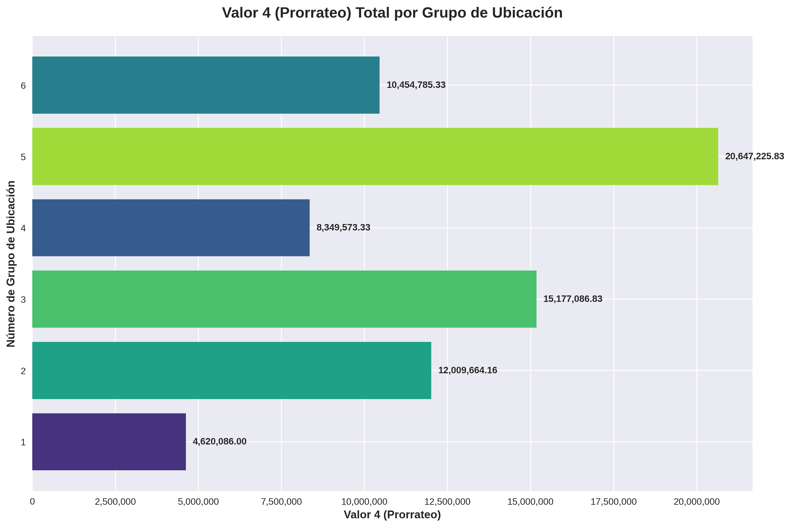

# 📊 Real Estate Data Pipeline & Analytics

Este proyecto es un pipeline de datos completo que automatiza la limpieza de activos inmobiliarios y visualiza indicadores clave. 

## 🚀 Demo En Vivo
Podés interactuar con el dashboard aquí: (https://huggingface.co/spaces/diegomm8991/data-analytics-dashboard)

## 🛠️ Tecnologías Utilizadas
* **Python (Pandas):** Limpieza y normalización de datos con RegEx.
* **Streamlit & Plotly:** Visualización de datos interactiva.
* **Docker:** Contenerización para despliegue consistente.
* **Hugging Face Spaces:** Hosting de la aplicación.

## 📁 Estructura del Proyecto
* `procesar_excel_profesional.py`: Script de backend que realiza el ETL.
* `app.py`: Interfaz de usuario del dashboard.
* `Dockerfile`: Configuración de la imagen para despliegue.

## 📈 Visualizaciones
